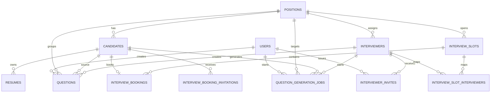

# HRProject DB ERD

기준: `back/app/models`의 SQLAlchemy 모델과 관련 코드를 기준으로 정리했습니다.

## ERD

## 관계 요약

| 부모 테이블 | 자식 테이블 | 관계 | 설명 |
|---|---|---|---|
| `users` | `questions` | 1:N | HR 사용자가 작성한 질문 |
| `users` | `interviewer_invites` | 1:N | HR 사용자가 발급한 면접관 초대 |
| `users` | `question_generation_jobs` | 1:N | 질문 생성 작업 요청자 |
| `positions` | `candidates` | 1:N | 지원자는 특정 포지션에 연결 가능 |
| `positions` | `questions` | 1:N | 질문은 포지션 기준으로 분류 가능 |
| `positions` | `interviewers` | 1:N | 면접관 소속 또는 담당 포지션 |
| `positions` | `interview_slots` | 1:N | 면접 슬롯의 대상 포지션 |
| `positions` | `question_generation_jobs` | 1:N | 질문 생성 대상 포지션 |
| `candidates` | `resumes` | 1:N | 지원자 이력서 원본 및 파싱 결과 |
| `candidates` | `questions` | 1:N | 특정 지원자 맞춤 질문 |
| `candidates` | `interview_bookings` | 논리상 1:0..1 | 모델상 `uselist=False`이나 DB UNIQUE 제약은 없음 |
| `candidates` | `interview_booking_invitations` | 1:N | 예약 링크 발송 이력 |
| `candidates` | `question_generation_jobs` | 1:N | 지원자 기준 질문 생성 작업 |
| `interview_slots` | `interview_bookings` | 1:N | 하나의 슬롯에 여러 예약 가능 |
| `interview_slots` | `interview_slot_interviewers` | 1:N | 슬롯-면접관 매핑 |
| `interviewers` | `interview_slot_interviewers` | 1:N | 슬롯-면접관 매핑 |
| `interviewers` | `questions` | 1:N | 면접관 작성 질문 |
| `interviewers` | `interviewer_invites` | 1:N | 면접관별 초대 토큰 |
| `interviewers` | `question_generation_jobs` | 1:N | 면접관 요청 질문 생성 작업 |

---

## `users`

| 변수명(한글) | 변수명(영어) | type | null 여부 | 제약조건 | 비고 |
|---|---|---|---|---|---|
| 사용자 ID | `user_id` | `INTEGER` | NOT NULL | PK, Auto Increment | 사용자 기본키 |
| 사용자 이메일 | `user_email` | `STRING` | NOT NULL | UNIQUE | 로그인 ID 역할 |
| 비밀번호 해시 | `pw_hash` | `STRING` | NOT NULL |  | 해시된 비밀번호 |
| 사용자명 | `user_name` | `STRING` | NOT NULL |  | 표시 이름 |
| 역할 | `role` | `STRING` | NOT NULL |  | 권한 구분 |
| 생성일시 | `created_at` | `TIMESTAMP WITH TIME ZONE` | NOT NULL | DEFAULT `now()` | 생성 시각 |

## `positions`

| 변수명(한글) | 변수명(영어) | type | null 여부 | 제약조건 | 비고 |
|---|---|---|---|---|---|
| 포지션 ID | `position_id` | `INTEGER` | NOT NULL | PK, Auto Increment | 채용 포지션 기본키 |
| 포지션명 | `position_name` | `VARCHAR(100)` | NOT NULL |  | 채용 직무명 |
| 생성일시 | `created_at` | `TIMESTAMP WITH TIME ZONE` | NOT NULL | DEFAULT `now()` | 생성 시각 |

## `candidates`

| 변수명(한글) | 변수명(영어) | type | null 여부 | 제약조건 | 비고 |
|---|---|---|---|---|---|
| 지원자 ID | `candidate_id` | `INTEGER` | NOT NULL | PK, Auto Increment | 지원자 기본키 |
| 지원 포지션 ID | `position_id` | `INTEGER` | NULL | FK -> `positions.position_id` | 지원 포지션 |
| 이름 | `name` | `VARCHAR(255)` | NULL |  | 지원자 이름 |
| 생년월일 | `date_of_birth` | `DATE` | NULL |  | 생년월일 |
| 성별 | `gender` | `VARCHAR(100)` | NULL |  | 성별 |
| 주소 | `address` | `VARCHAR(2000)` | NULL |  | 주소 |
| 전화번호 | `phone` | `VARCHAR(100)` | NULL |  | 연락처 |
| 이메일 | `email` | `VARCHAR(255)` | NULL |  | 지원자 이메일, 현재 UNIQUE 제약 없음 |
| 경력 구분 | `experience_level` | `VARCHAR(20)` | NOT NULL | DEFAULT `'신입'` | `신입/경력/무관` 등 |
| 지원 단계 | `application_status` | `VARCHAR(20)` | NOT NULL |  | 예: `서류/면접/최종합격/불합격` |
| 최종 상태 | `final_status` | `VARCHAR(20)` | NOT NULL | DEFAULT `'진행중'` | 예: `진행중/합격/불합격` |
| 우대조건 충족 항목 | `meets_preferred_criteria` | `JSONB` | NOT NULL | DEFAULT `[]::jsonb` | 우대조건 매칭 결과 목록 |
| 생성일시 | `created_at` | `TIMESTAMP WITH TIME ZONE` | NOT NULL | DEFAULT `now()` | 생성 시각 |
| 수정일시 | `updated_at` | `TIMESTAMP WITH TIME ZONE` | NOT NULL | DEFAULT `now()`, ON UPDATE `now()` | 수정 시각 |

## `resumes`

| 변수명(한글) | 변수명(영어) | type | null 여부 | 제약조건 | 비고 |
|---|---|---|---|---|---|
| 이력서 ID | `resume_id` | `INTEGER` | NOT NULL | PK, Auto Increment | 이력서 기본키 |
| 지원자 ID | `candidate_id` | `INTEGER` | NOT NULL | FK -> `candidates.candidate_id` | 소유 지원자 |
| 희망 근무지 | `desired_location` | `VARCHAR(100)` | NULL |  | 파싱된 희망 지역 |
| 희망 연봉 | `desired_salary` | `INTEGER` | NULL |  | 파싱된 희망 연봉 |
| 파일 경로 | `file_path` | `VARCHAR(500)` | NULL |  | 원본 이력서 저장 경로 |
| 원문 텍스트 | `raw_text` | `TEXT` | NULL |  | OCR/텍스트 추출 결과 |
| 파싱 JSON | `parsed_json` | `JSONB` | NULL |  | 구조화된 이력서 데이터 |
| 요약 | `summary` | `TEXT` | NULL |  | AI 요약 |
| AI 프로필 | `ai_profile` | `JSONB` | NULL |  | 질문 생성용 요약 프로필 |
| 생성일시 | `created_at` | `TIMESTAMP WITH TIME ZONE` | NOT NULL | DEFAULT `now()` | 생성 시각 |
| 수정일시 | `updated_at` | `TIMESTAMP WITH TIME ZONE` | NOT NULL | DEFAULT `now()`, ON UPDATE `now()` | 수정 시각 |

## `questions`

| 변수명(한글) | 변수명(영어) | type | null 여부 | 제약조건 | 비고 |
|---|---|---|---|---|---|
| 질문 ID | `question_id` | `INTEGER` | NOT NULL | PK, Auto Increment | 질문 기본키 |
| 지원자 ID | `candidate_id` | `INTEGER` | NULL | FK -> `candidates.candidate_id`, ON DELETE SET NULL | 특정 지원자 대상 질문 |
| 포지션 ID | `position_id` | `INTEGER` | NULL | FK -> `positions.position_id`, ON DELETE SET NULL | 포지션 기반 질문 |
| 질문 내용 | `question_text` | `TEXT` | NOT NULL |  | 실제 질문 문장 |
| 질문 유형 | `question_type` | `VARCHAR(30)` | NOT NULL |  | 기술, 인성 등 유형 |
| 평가 의도 | `evaluation_intent` | `TEXT` | NULL |  | 무엇을 평가하려는지 |
| 생성 근거 | `generation_basis` | `TEXT` | NULL |  | 질문 생성 근거 |
| 생성일시 | `created_at` | `TIMESTAMP WITH TIME ZONE` | NOT NULL | DEFAULT `now()` | 생성 시각 |
| 작성 사용자 ID | `created_by_user_id` | `INTEGER` | NULL | FK -> `users.user_id`, ON DELETE SET NULL | HR 작성자 |
| 작성 면접관 ID | `created_by_interviewer_id` | `INTEGER` | NULL | FK -> `interviewers.interviewer_id`, ON DELETE SET NULL | 면접관 작성자 |

## `email_templates`

| 변수명(한글) | 변수명(영어) | type | null 여부 | 제약조건 | 비고 |
|---|---|---|---|---|---|
| 템플릿 ID | `id` | `INTEGER` | NOT NULL | PK, Auto Increment | 메일 템플릿 기본키 |
| 템플릿명 | `name` | `VARCHAR(100)` | NOT NULL |  | 템플릿 이름 |
| 메일 제목 | `subject` | `VARCHAR(255)` | NOT NULL |  | 메일 제목 |
| 메일 본문 | `body` | `TEXT` | NOT NULL |  | 템플릿 내용 |

## `interviewers`

| 변수명(한글) | 변수명(영어) | type | null 여부 | 제약조건 | 비고 |
|---|---|---|---|---|---|
| 면접관 ID | `interviewer_id` | `INTEGER` | NOT NULL | PK, Auto Increment | 면접관 기본키 |
| 면접관 이메일 | `interviewer_email` | `STRING` | NOT NULL |  | 로그인 또는 연락처 역할 |
| 면접관 이름 | `interviewer_name` | `STRING` | NOT NULL |  | 이름 |
| 담당 포지션 ID | `position_id` | `INTEGER` | NULL | FK -> `positions.position_id`, ON DELETE SET NULL, INDEX | 담당 직무 |
| 담당 라운드 | `interview_round` | `VARCHAR(20)` | NULL | CHECK `NULL or ('1차','2차','3차')` | 면접 차수 |
| 생성일시 | `created_at` | `TIMESTAMP WITH TIME ZONE` | NOT NULL | DEFAULT `now()` | 생성 시각 |

## `interviewer_invites`

| 변수명(한글) | 변수명(영어) | type | null 여부 | 제약조건 | 비고 |
|---|---|---|---|---|---|
| 초대 ID | `invite_id` | `INTEGER` | NOT NULL | PK, Auto Increment | 면접관 초대 기본키 |
| 면접관 ID | `interviewer_id` | `INTEGER` | NOT NULL | FK -> `interviewers.interviewer_id`, ON DELETE CASCADE, INDEX | 초대 대상 면접관 |
| 토큰 해시 | `token_hash` | `VARCHAR(128)` | NOT NULL | UNIQUE, INDEX | 초대 링크 검증용 |
| 원본 토큰 | `raw_token` | `VARCHAR(256)` | NULL |  | 발송 전 확인용 값 저장 |
| 만료일시 | `expires_at` | `TIMESTAMP WITH TIME ZONE` | NOT NULL |  | 링크 만료 시각 |
| 철회일시 | `revoked_at` | `TIMESTAMP WITH TIME ZONE` | NULL |  | 링크 철회 시각 |
| 마지막 사용일시 | `last_used_at` | `TIMESTAMP WITH TIME ZONE` | NULL |  | 마지막 접속 시각 |
| 생성 사용자 ID | `created_by_user_id` | `INTEGER` | NULL | FK -> `users.user_id`, ON DELETE SET NULL, INDEX | 초대 발급자 |
| 생성일시 | `created_at` | `TIMESTAMP WITH TIME ZONE` | NOT NULL | DEFAULT `now()` | 생성 시각 |

## `interview_slots`

| 변수명(한글) | 변수명(영어) | type | null 여부 | 제약조건 | 비고 |
|---|---|---|---|---|---|
| 슬롯 ID | `slot_id` | `INTEGER` | NOT NULL | PK, Auto Increment | 면접 일정 슬롯 기본키 |
| 포지션 ID | `position_id` | `INTEGER` | NULL | FK -> `positions.position_id`, ON DELETE SET NULL | 대상 포지션 |
| 면접 라운드 | `interview_round` | `VARCHAR(20)` | NOT NULL | CHECK `('1차','2차','3차')` | 면접 차수 |
| 면접 시작일시 | `interview_starts_at` | `TIMESTAMP WITH TIME ZONE` | NOT NULL | CHECK `start < end` | 실제 시작 시각 |
| 면접 종료일시 | `interview_ends_at` | `TIMESTAMP WITH TIME ZONE` | NOT NULL | CHECK `start < end` | 실제 종료 시각 |
| 예약 마감일시 | `booking_deadline_at` | `TIMESTAMP WITH TIME ZONE` | NULL | CHECK `deadline <= start` | 예약 가능 마감 |
| 면접 장소 | `interview_location` | `VARCHAR(255)` | NULL |  | 오프라인, 온라인 장소 |
| 수용 인원 | `capacity` | `INTEGER` | NOT NULL |  | 예약 가능 인원 |
| 슬롯 상태 | `slot_status` | `VARCHAR(20)` | NOT NULL | DEFAULT `'open'`, CHECK `('open','full','closed')` | 현재 슬롯 상태 |
| 생성일시 | `created_at` | `TIMESTAMP WITH TIME ZONE` | NOT NULL | DEFAULT `now()` | 생성 시각 |

## `interview_slot_interviewers`

| 변수명(한글) | 변수명(영어) | type | null 여부 | 제약조건 | 비고 |
|---|---|---|---|---|---|
| 매핑 ID | `id` | `INTEGER` | NOT NULL | PK, Auto Increment | 슬롯-면접관 연결 기본키 |
| 슬롯 ID | `slot_id` | `INTEGER` | NOT NULL | FK -> `interview_slots.slot_id`, ON DELETE CASCADE | 연결된 슬롯 |
| 면접관 ID | `interviewer_id` | `INTEGER` | NOT NULL | FK -> `interviewers.interviewer_id`, ON DELETE RESTRICT | 연결된 면접관 |
| 생성일시 | `created_at` | `TIMESTAMP WITH TIME ZONE` | NOT NULL | DEFAULT `now()` | 매핑 생성 시각 |

추가 제약: UNIQUE `uq_slot_interviewer (slot_id, interviewer_id)`

## `interview_bookings`

| 변수명(한글) | 변수명(영어) | type | null 여부 | 제약조건 | 비고 |
|---|---|---|---|---|---|
| 예약 ID | `booking_id` | `INTEGER` | NOT NULL | PK, Auto Increment | 면접 예약 기본키 |
| 슬롯 ID | `slot_id` | `INTEGER` | NOT NULL | FK -> `interview_slots.slot_id`, ON DELETE RESTRICT | 예약된 슬롯 |
| 지원자 ID | `candidate_id` | `INTEGER` | NOT NULL | FK -> `candidates.candidate_id`, ON DELETE CASCADE | 예약한 지원자 |
| 생성일시 | `created_at` | `TIMESTAMP WITH TIME ZONE` | NOT NULL | DEFAULT `now()` | 예약 확정 시각 |
| 취소일시 | `cancelled_at` | `TIMESTAMP WITH TIME ZONE` | NULL | CHECK `cancelled_at IS NULL OR cancelled_at >= created_at` | 취소 시각 |

## `interview_booking_invitations`

| 변수명(한글) | 변수명(영어) | type | null 여부 | 제약조건 | 비고 |
|---|---|---|---|---|---|
| 초대 ID | `invitation_id` | `INTEGER` | NOT NULL | PK, Auto Increment | 예약 초대 기본키 |
| 지원자 ID | `candidate_id` | `INTEGER` | NOT NULL | FK -> `candidates.candidate_id`, ON DELETE CASCADE, INDEX | 초대 대상 지원자 |
| 토큰 해시 | `token_hash` | `VARCHAR(64)` | NOT NULL | UNIQUE | 예약 링크 검증용 |
| 만료일시 | `expires_at` | `TIMESTAMP WITH TIME ZONE` | NOT NULL | INDEX | 링크 만료 시각 |
| 허용 슬롯 ID 목록 | `allowed_slot_ids` | `JSON` | NULL |  | 선택 가능한 슬롯 ID 배열 |
| 철회일시 | `revoked_at` | `TIMESTAMP WITH TIME ZONE` | NULL |  | 링크 철회 시각 |
| 생성일시 | `created_at` | `TIMESTAMP WITH TIME ZONE` | NOT NULL | DEFAULT `now()` | 생성 시각 |

## `question_generation_jobs`

| 변수명(한글) | 변수명(영어) | type | null 여부 | 제약조건 | 비고 |
|---|---|---|---|---|---|
| 작업 ID | `job_id` | `INTEGER` | NOT NULL | PK, Auto Increment | 질문 생성 작업 기본키 |
| 상태 | `status` | `VARCHAR(20)` | NOT NULL | DEFAULT `'queued'`, INDEX, CHECK `('queued','running','succeeded','failed')` | 작업 상태 |
| 지원자 ID | `candidate_id` | `INTEGER` | NOT NULL | FK -> `candidates.candidate_id`, ON DELETE CASCADE, INDEX | 질문 대상 지원자 |
| 포지션 ID | `position_id` | `INTEGER` | NULL | FK -> `positions.position_id`, ON DELETE SET NULL, INDEX | 질문 대상 포지션 |
| 생성 요청 사용자 ID | `created_by_user_id` | `INTEGER` | NULL | FK -> `users.user_id`, ON DELETE SET NULL, INDEX | HR 요청자 |
| 생성 요청 면접관 ID | `created_by_interviewer_id` | `INTEGER` | NULL | FK -> `interviewers.interviewer_id`, ON DELETE SET NULL, INDEX | 면접관 요청자 |
| 요청 페이로드 | `request_payload` | `JSON` | NOT NULL |  | 생성 입력값 전체 |
| 생성 결과 질문 목록 | `result_questions` | `JSON` | NULL |  | 생성 완료 결과 |
| 오류 메시지 | `error_message` | `TEXT` | NULL |  | 실패 사유 |
| 생성일시 | `created_at` | `TIMESTAMP WITH TIME ZONE` | NOT NULL | DEFAULT `now()` | 작업 생성 시각 |
| 시작일시 | `started_at` | `TIMESTAMP WITH TIME ZONE` | NULL |  | 실제 시작 시각 |
| 종료일시 | `finished_at` | `TIMESTAMP WITH TIME ZONE` | NULL |  | 완료 시각 |

추가 인덱스:

- `ix_question_generation_jobs_active_user`: `created_by_user_id`에 대한 partial unique index
- `ix_question_generation_jobs_active_interviewer`: `created_by_interviewer_id`에 대한 partial unique index
- 의미: 같은 사용자 또는 같은 면접관은 `queued/running` 상태의 활성 작업을 동시에 1개만 가질 수 있음
