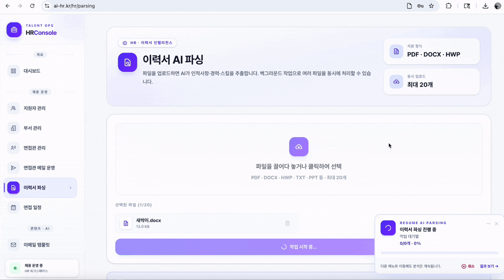
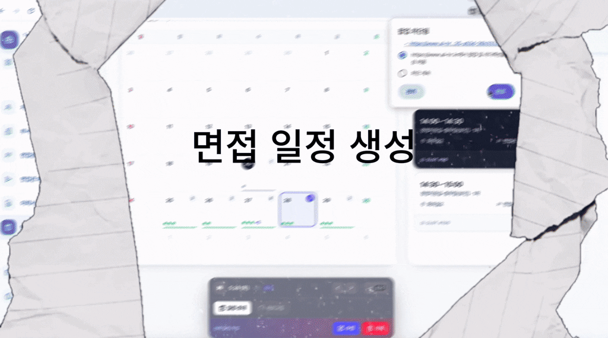
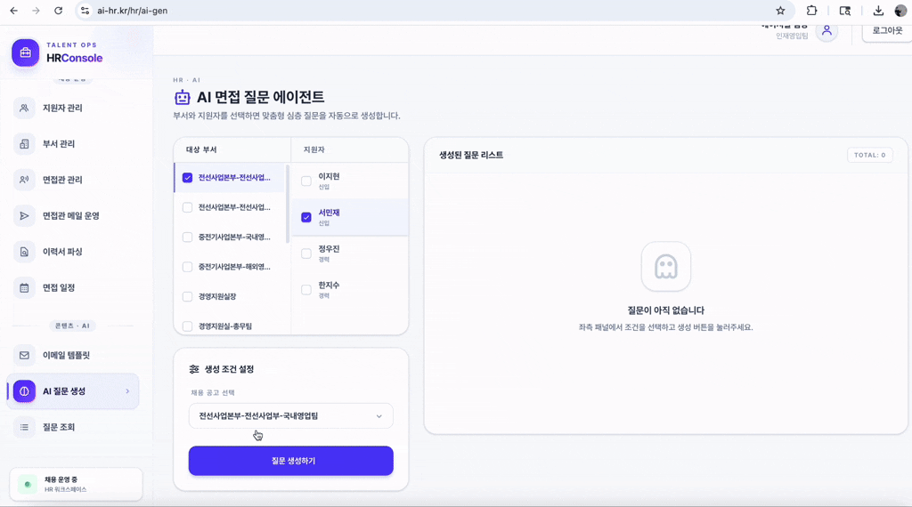
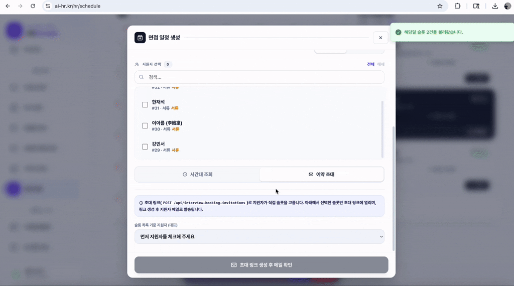
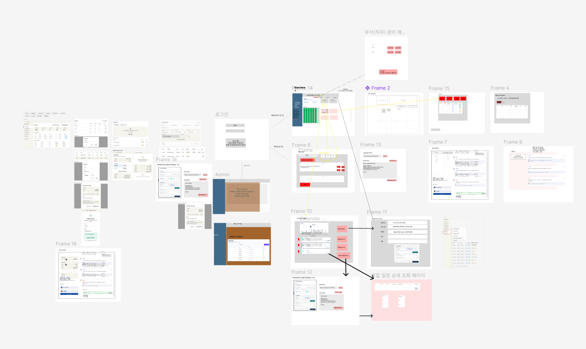
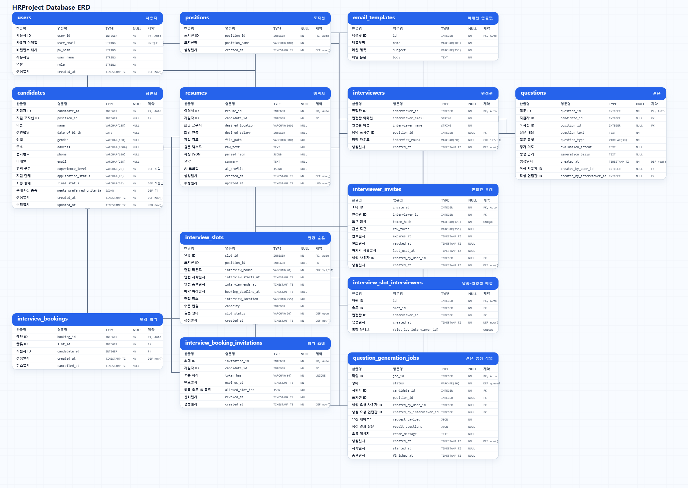

# 📊 프로젝트 설명

채용 담당자와 면접관의 반복 업무를 줄이기 위한, AI를 활용한 HR 채용 운영 지원 시스템

---
## ✨ 기획 배경
- 각 기업내 HR·그룹웨어 내부 시스템 수요 증가에 주목 → 현업 채용 담당자의 반복 업무를 줄이는 사내 솔루션 기획
---
## 🚀 주요 기능

### 이력서 업로드를 통한 지원자 정보 분류 및 저장

1. 이력서 업로드
2. 지원자 목록

### 면접 일정 생성 및 관리

1. 면접 일정 생성
2. 면접 일정 조회

### AI 활용한 면접 질문 생성 및 관리

1. 면접 질문 생성
2. 면접 질문 조회
3. 면접관용 면접 질문 생성

### 지원자의 면접 예약 기능 (매직 링크 활용)

1. 지원자의 면접 예약

---

## 개발 기간 ⏱️
26.04.10 - 26.05.20

---

## 맴버 구성 🧑‍🤝‍🧑
- 김진우: Back, AI
- 남건우: Back, AI
- 박세형: PM
- 사비카: Back, AI
- 한다솔: Front, AI

---

## 🛠 기술 스택 (Tech Stack)
| 분류 | 기술 |
| :-: | :-: | 
| Framework |   | 
|Styling|  |
|Library|Recharts, Framer Motion|

---

## 📱 설계 문서
### 와이어프레임


### ERD


### API 명세서
https://certain-canvas-9ee.notion.site/07ddf13d6ea08202a55a01350d360048?v=f92df13d6ea083bdb2f80856ec05c234&source=copy_link

---

## 🔗 실행 방법

### Backend
```
back 폴더에서 실행
uv sync
.env 생성 및 내용 추가
사용할 DB 생성 후 .env에 입력.
uv run alembic upgrade head (기존 테이블들 이미 존재하면 생략)
uv run fastapi dev

상세 내용은 back 폴더의 readme.md 참고
```

### Frontend
```
front 폴더에서 실행
npm install
.env 생성 및 내용 추가
npm run dev
```

### Docker
- 도커 설정은 프론트 + 백엔드 + nginx만 되어 있는 상태.
- 현재 도커 설정은 개발용, 테스트용임.
- 도커 사용하려면 .env의 port가 달라질 수 있음. (docker의 경우 백엔드의 .env에 있는 프론트 주소의 포트 번호가 3000이 아니게 됨.)
- 프로젝트 실행에 사용할 DB(postgreSQL) 필요.
- 개선하면서 추가로 변경될 수 있음.
```
root 폴더에서 docker compose up --build 실행.

## DB에 alembic 마이그레이션 필요한 경우
docker compose exec back uv run alembic upgrade head

## 초기 관리자 세팅이 필요한 경우
docker compose exec back uv run python scripts/create_initial_admin.py
```

## git 커밋 컨벤션

### 커밋 메시지

```
타입: 변경 내용 요약
```

예시:

```
init: 개발 환경 초기 세팅
feat: 리뷰 크롤링 API 추가
fix: 감성 분석 점수 계산 오류 수정
docs: README 설치 방법 업데이트
refactor: 크롤링 모듈 구조 개선
style: 코드 포매팅 적용
test: 감성 분석 유닛 테스트 추가
chore: Docker 설정 변경
MR: 머지 리퀘스트
```


## 브랜치 전략
* 브랜치 전략은 main -> develop -> feature/backend-기능명, feature/frontend-기능명
* 가능한 지키기!
```
main          ← 배포 (프로덕션)
  └── develop     ← 개발 통합 브랜치
        ├── feature/backend-auth      ← 백엔드 기능
        ├── feature/frontend-login    ← 프론트 기능
        └── feature/user-api          ← 기능 단위
```

## 📂 파일 구조

### FrontEnd (Next.js + TypeScript)

```
📦front
┣ 📂app
┃ ┣ 📂(auth)
┃ ┃ ┣ 📂login
┃ ┃ ┗ 📂signup
┃ ┣ 📂admin
┃ ┃ ┣ 📂routes
┃ ┃ ┗ 📂users
┃ ┣ 📂api
┃ ┃ ┣ 📂auth
┃ ┃ ┗ 📂interviewers
┃ ┣ 📂applicant
┃ ┣ 📂hr
┃ ┃ ┣ 📂ai-gen
┃ ┃ ┣ 📂applicants
┃ ┃ ┣ 📂email-templates
┃ ┃ ┣ 📂interviewers
┃ ┃ ┃ ┗ 📂communication
┃ ┃ ┣ 📂parsing
┃ ┃ ┣ 📂positions
┃ ┃ ┣ 📂profile
┃ ┃ ┣ 📂questions
┃ ┃ ┗ 📂schedule
┃ ┃   ┗ 📂invitation-preview
┃ ┣ 📂interview-booking
┃ ┣ 📂interviewer
┃ ┃ ┗ 📂invite
┃ ┣ 📂interviewer-availability
┃ ┣ 📂interviewer-invite
┃ ┣ 📂invitation-preview
┃ ┣ 📂maintenance
┃ ┣ 📂server
┃ ┃ ┣ 📂admin
┃ ┃ ┣ 📂auth
┃ ┃ ┣ 📂common
┃ ┃ ┣ 📂hr
┃ ┃ ┣ 📂http
┃ ┃ ┗ 📂interviewer
┃ ┣ 📜favicon.ico
┃ ┣ 📜globals.css
┃ ┣ 📜layout.tsx
┃ ┣ 📜not-found.tsx
┃ ┣ 📜page.tsx
┃ ┗ 📜providers.tsx
┣ 📂components
┃ ┣ 📂admin
┃ ┃ ┗ 📂usertable
┃ ┣ 📂auth
┃ ┣ 📂common
┃ ┣ 📂hr
┃ ┃ ┣ 📂applicants
┃ ┃ ┣ 📂dashboard
┃ ┃ ┃ ┗ 📂dept-status
┃ ┃ ┣ 📂email-templates
┃ ┃ ┣ 📂interviewers
┃ ┃ ┃ ┗ 📂mail-composer
┃ ┃ ┣ 📂parsing
┃ ┃ ┣ 📂positions
┃ ┃ ┣ 📂profile
┃ ┃ ┣ 📂question-generation
┃ ┃ ┣ 📂questions
┃ ┃ ┣ 📂schedule
┃ ┃ ┣ 📂shared
┃ ┃ ┗ 📂wrapper
┃ ┣ 📂interview-booking
┃ ┣ 📂interviewer
┃ ┃ ┣ 📂agent
┃ ┃ ┣ 📂availability
┃ ┃ ┣ 📂invite
┃ ┃ ┗ 📂layout
┃ ┣ 📂landing
┃ ┗ 📂ui
┣ 📂css
┃ ┗ 📂background
┣ 📂hooks
┣ 📂lib
┃ ┣ 📂admin
┃ ┣ 📂auth
┃ ┣ 📂common
┃ ┣ 📂hr
┃ ┣ 📂interviewer
┃ ┣ 📂stores
┃ ┣ 📂ui
┃ ┗ 📂utils
┣ 📂public
┣ 📂types
┣ 📜.dockerignore
┣ 📜.env
┣ 📜.gitignore
┣ 📜AGENTS.md
┣ 📜CLAUDE.md
┣ 📜Dockerfile
┣ 📜eslint.config.mjs
┣ 📜next-env.d.ts
┣ 📜next.config.ts
┣ 📜package-lock.json
┣ 📜package.json
┣ 📜postcss.config.mjs
┣ 📜proxy.ts
┣ 📜README.md
┗ 📜tsconfig.json
```

### BackEnd (FastAPI + Python)

```
📦back
┣ 📂alembic
┃ ┣ 📂versions
┃ ┣ 📜env.py
┃ ┣ 📜README
┃ ┗ 📜script.py.mako
┣ 📂app
┃ ┣ 📂ai
┃ ┃ ┣ 📂agents
┃ ┃ ┣ 📂clients
┃ ┃ ┣ 📂generators
┃ ┃ ┣ 📂graphs
┃ ┃ ┃ ┗ 📂interview_question
┃ ┃ ┃   ┗ 📂nodes
┃ ┃ ┣ 📂jd
┃ ┃ ┣ 📂prompts
┃ ┃ ┃ ┗ 📂interview_question
┃ ┃ ┗ 📂schemas
┃ ┣ 📂core
┃ ┣ 📂dependencies
┃ ┣ 📂models
┃ ┣ 📂repositories
┃ ┣ 📂routers
┃ ┣ 📂schemas
┃ ┣ 📂services
┃ ┣ 📜__init__.py
┃ ┗ 📜main.py
┣ 📂scripts
┃ ┗ 📜create_initial_admin.py
┣ 📂tests
┣ 📜.dockerignore
┣ 📜.env
┣ 📜.gitignore
┣ 📜.python-version
┣ 📜alembic.ini
┣ 📜Dockerfile
┣ 📜graph.py
┣ 📜init_vectordb.py
┣ 📜mailsend.py
┣ 📜ParsingToExcel.py
┣ 📜Procfile
┣ 📜pyproject.toml
┣ 📜README.md
┗ 📜uv.lock
```